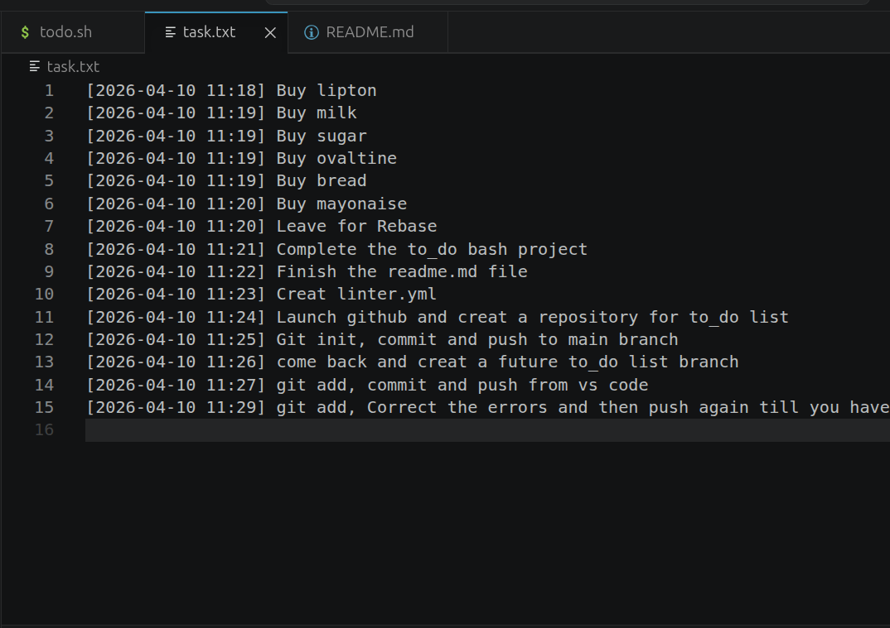
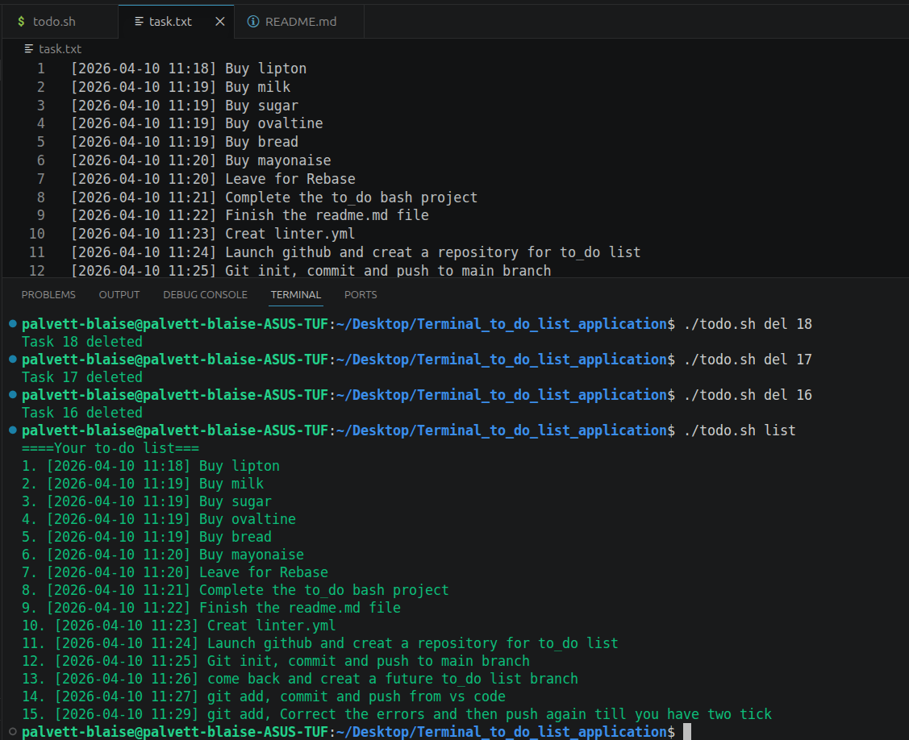

# 🏷 Project Name

Terminal to-do list application

## 📌 Problem Statement
This bash script solves the problem of creating and keeping tract of things you are to-do, avoiding the duplication of task,removing completed tast, keeping tract of the time and removing all the task list.

## 🎯 Project Goals
Adds the number of things you have to do thereby creating a list.
Displays the list of task in a file called task.txt.
Removes completed or selected task in your to-do list.
Prevents the duplication of task on your to-do list.
Dispays your list on the terminal in green color (todo.sh list).
Respond to all input errors with a red color.
Prints a date and timestamp when you add each task.
Clears the complete old list and gives room to start creating another list.

## 🖥 Features

Creats a file and add task to the file.
List the task.
Deletes task one at a time.
Claerars the list amongst other smart validations.

## 📷 Screenshots

## How to run the code

./todo.sh=to enter the command menu.
./todo.sh add "task"=to add a task.
./todo.sh list=to see the complete list availabe.
./todo.sh del "number"=to delete a particular task.
./todo.sh clear=to delete all the task on the list.
